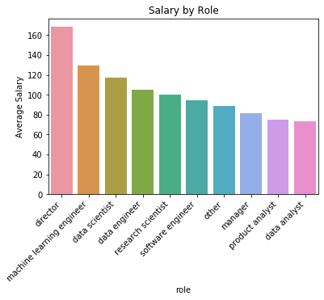
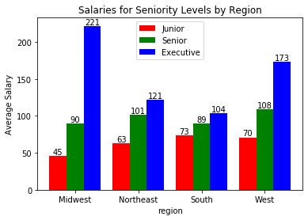
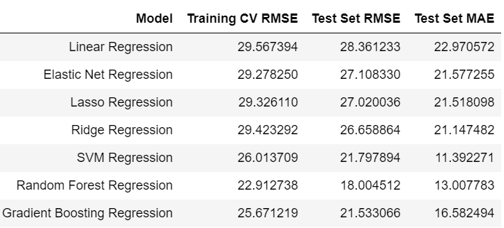
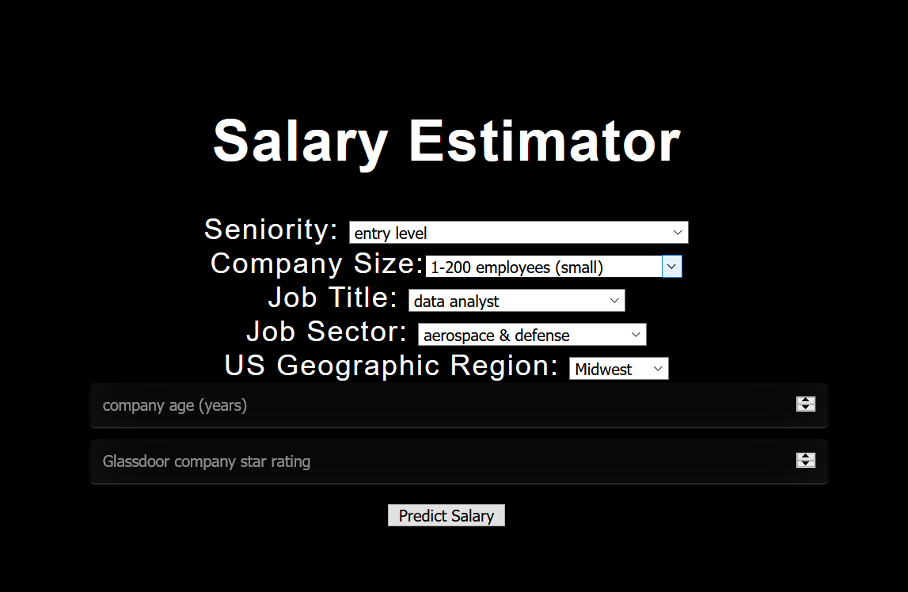
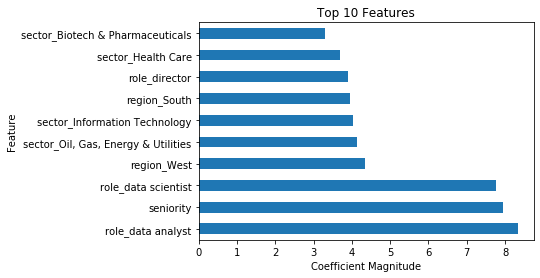
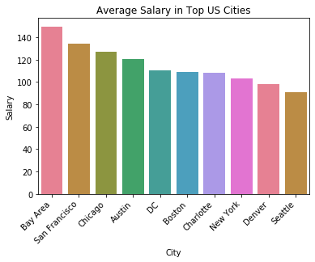
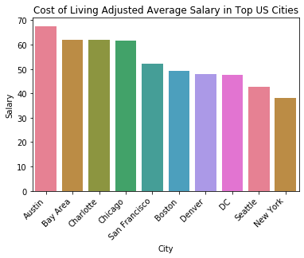

# Glassdoor_Salary_Analysis

## Background

I am a recent graduate of NC State University and during my last year here I spent a lot of time applying for Data Science jobs and interviewing at different companies. Glassdoor is a pretty well known tool to get company reviews and feedback from other candidates/employees as well as gain insight into the salary ranges for different roles at various companies. The salary estimation ranges were pretty useful as a baseline, but the compensation depends heavily on the type of role as well as many other factors so the estimation is not always very accurate. I wanted to create a tool oriented specifically around the Data Science field and uses machine learning models to provide a more accurate salary estimation for these types of roles. I think this information would be very useful for candidates like myself interviewing for data related roles at any level.

## Dependencies

If you want to run the code from this analysis, you should first ensure that you have all of the necessary packages installed on your machine locally. Run the line below in the command prompt to install the most up to date dependencies that are used in this project.

```
pip install -r requirements.txt
```

## Project Steps

### 1) Web Scraping

To obtain the data used in this project I scraped job postings off of the Glassdoor website directly. I scraped 1,000 job postings from the search query "Data Scientist" in the GLassdoor jobs search. The *web_scraper* folder contains the script I used to perform this web scraping. If you wish to scrape a similar amount of data, it may need to be left to run overnight as it does take a while to avoid overloading the website with requests.


### 2) Data Cleaning

The scraped data contained many fields that contained messy strings with strange characters with which I would need to parse out the desired data. I performed feature engineering to consolidate and categorize the categorical fields into smaller groups. For example, I consolidated the city and state location of each company down to US geographical region to reduce the number of variables. I grouped many other fields in a similar manner to reduce the dimensionality of the dataset. To get a uniform response variable for modeling, I took the average salary of the given range on the job posting.

### 3) Exploratory Data Analysis




### 4) Modeling

The modeling phase started with breaking the data into a training and test set with an 80/20 split respectively and creating a scaled version of the dataset that will be used by some of the models. I started simply with linear regression and tested other models progressively up to more advanced models such as gradient boosted regression. I used 5-fold cross validation on the training set to choose the best parameters for the model and to pick the best performing model, and I then tested each model's performance on unseen data with the test set to get an unbiased measure of success.

The models attempted and their respective results are as follows:


### 5) Deploying Model to Production

I used a flask backend along with an HTML/CSS/Javascript front end to create a simple GUI that allows the user to easy use the model locally. The web app accesses the pickled Random Forest model file that was exported from the modeling phase. The user will enter a couple values into the form and click the predict button to see the model output of their estimated salary based on the provided data. Usage instructions for running the web app can be seen in the section below. 



## Conclusions





## Using the Webapp

1) Run app.py
2) Naviate to your localhost at 127.0.0.1:5000 in the URL bar
3) You should now see the GUI for the salary estimator
4) Choose the values from the drop down box for your current job
5) Lookup your company on Glassdoor and enter the age of the company and star rating in the input boxes
6) Click on the "Predict Salary" button to see the estimated salary that the model predicts for you


