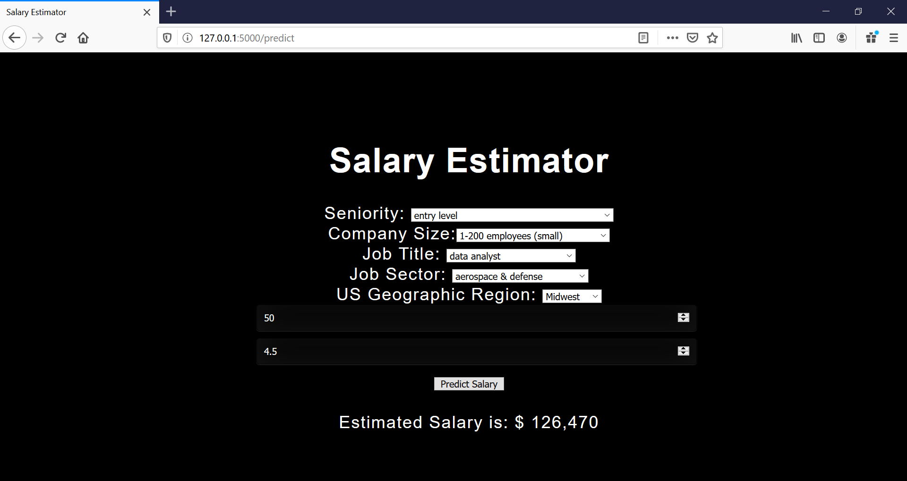

# Glassdoor_Salary_Analysis

## Using the Webapp

1) Run app.py
2) Naviate to your localhost at 127.0.0.1:5000 in the URL bar
3) You should now see the GUI for the salary estimator
4) Choose the values from the drop down box for your current job
5) Lookup your company on Glassdoor and enter the age of the company and star rating in the input boxes
6) Click on the "Predict Salary" button to see the estimated salary that the model predicts for you

